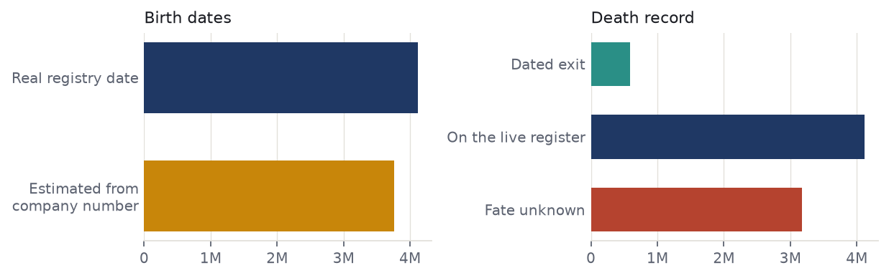
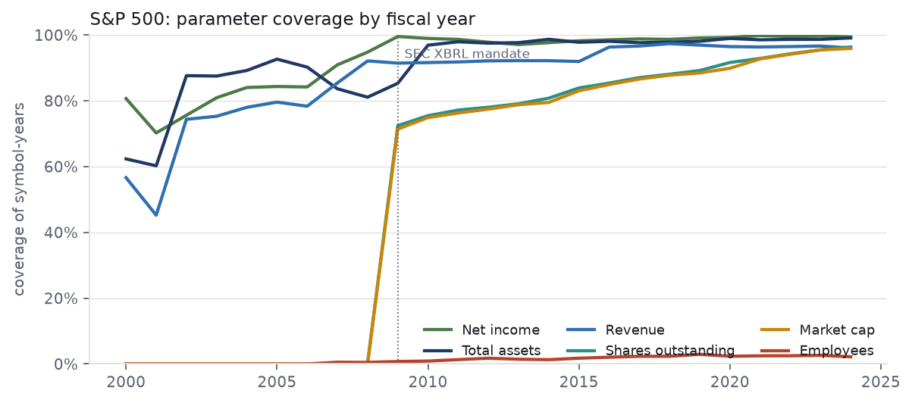
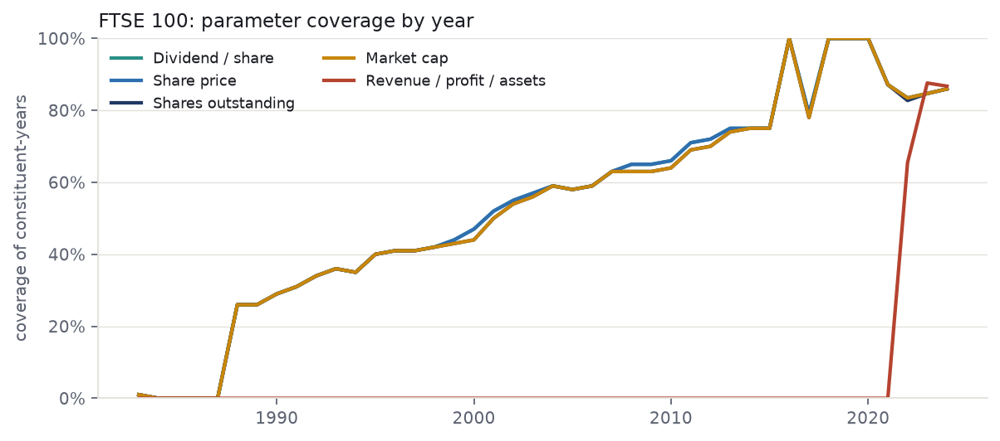
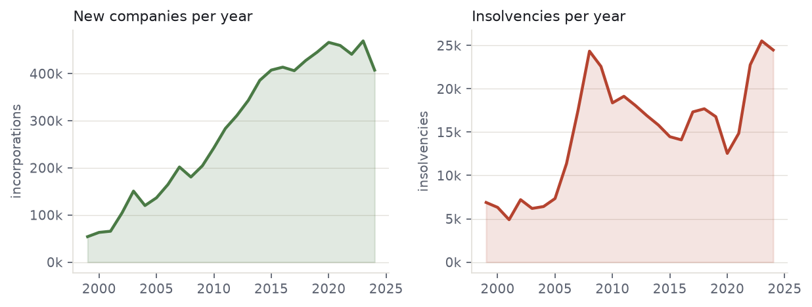

# UK Business Dynamism Database
## Project handover

### 1. Where the project stands

The database links the birth, life and death of British companies at whole-population scale, and overlays the FTSE 100 and S&P 500 as tracked indices. It is a single DuckDB file (21 tables, ~39M firm-year rows) plus a set of clean, fully-sourced CSVs and two Excel workbooks. Every value is either a fact carrying a source URL (or a document citation where the source is licensed) or is left blank. Sourced is not validated: a small number of filed-accounts and market-cap values are implausible and are excluded at the point of use (section 5).

Current state: the whole-population Companies House and Gazette layers are complete; S&P 500 financials are strong (revenue/profit/assets 90–95% from 2000); FTSE 100 membership and recent market data are complete, with a known pre-2022 fundamentals gap that needs a licensed source (LSEG).

One background job (Companies House company profiles) is still running and will be added when it finishes:

The universe is 7,877,348 UK companies (`firm_master`). 4.12M have real registry incorporation dates and 3.76M more had their birth year estimated from the sequential company number; all but 112 appear in the filings panel, so the estimate rests on a real filing footprint. Companies House birth and death coverage is being completed by the running extraction: it fetches a real incorporation date and dissolution date for every company in the ~3.3M queue. The queue is the 3,280,327 companies neither on the live register nor carrying a recorded dissolution, so it resolves most but not all of the 3.76M estimates. Once the scrape finishes, these dates need merging from `ch_company_profile` into `firm_master`/`exit_events` to give complete, sourced birth-and-death for every company Companies House holds a record for (a small tail of pre-digital companies will remain unresolved).



*Birth dates: 4.12M sourced against 3.76M estimated. Death record: 583,548 dated exits, 4.12M on the live register, 3.18M of unrecorded fate.*

### 2. The Folder

Everything lives in one folder, `business_dynamism_shaamini` (the handoff package). The eight parts:

| Folder | What's in it |
| --- | --- |
| `database/` | The canonical DuckDB file (21 tables). The `.zst` backup currently in the repo is an earlier build than the live file — see section 5. |
| `deliverables/` | The ready-to-use outputs — start here (see below). |
| `source_inputs/` | Raw and handover CSVs the database was built from (working files; the clean versions are in deliverables). Also holds `ftse100_sector_classification.csv`, the FTSE sector classification. |
| `python/` | All build and fetch scripts. |
| `sql/` | The Postgres build steps 01–12, run in order against the local Postgres instance, before the DuckDB assembly. |
| `docs/` | Task briefs and method notes (incl. the LSEG spec and the two market-data briefs). |
| `reports/` | Standalone HTML reports — open in a browser. |
| `vercel_site/` | The public site: a static page whose every figure is computed from the database at build time by `python/build_site_data.py`. |

#### The source CSVs (`deliverables/`)

There are three ways to read the same sourced data, by preference:

1. **Two Excel workbooks** — `ftse_sources.xlsx` and `sp500_sources.xlsx`. One tab per parameter (Revenue, Net Income, Total Assets, Market Cap, Shares, plus FTSE Share Price/Dividend or S&P Employees), each value paired with its `source_url`. A Spine tab holds identity + entry/exit dates with their sources, and a Birth/Founding tab holds founding dates.
2. **Per-parameter CSVs** — `deliverables/ftse/` and `deliverables/sp500/` hold one dedicated CSV per parameter (e.g. `sp500_market_cap.csv`), each with value + `source_url`. The `*_spine.csv` files carry entry/exit dates and their sources.
3. **Wide consolidated CSVs** — `deliverables/consolidated/` holds `FTSE100_consolidated.csv` and `SP500_consolidated.csv` (every parameter + source columns in one sheet), plus the founding-date files and the "genuinely new company at index entry" analysis.

On sources: S&P entry/exit and financials carry real per-company URLs (SEC EDGAR, the Wurgler S&P-changes dataset, SPGlobal press releases). FTSE entry/exit carry a citation rather than a URL ("LSEG FTSE 100 Historic Additions & Deletions" for exits, the CBP 1984 launch roster for founders) because the LSEG source is licensed and has no public link.

### 3. The database

One file, no server or login. Open it read-only in Python:

```python
import duckdb
c = duckdb.connect('database/business_dynamism_v2_20260824d.duckdb', read_only=True)
c.execute('show tables').fetchall()
```

The 21 tables fall into four groups:

| Group | Key tables (rows) | What it is |
| --- | --- | --- |
| Whole-population | `firm_master` (7.9M), `companies` (5.7M), `combined_firm_year` (39.4M), `firm_year_panel` (39.1M) | Every UK company: identity, birth year, SIC, status, and the year-by-year financial panel from filings. |
| Exit / death | `exit_events` (583k), `gazette_events` (1.0M) | Insolvency, from London Gazette notices. |
| FTSE 100 | `ftse100_membership`, `ftse100_compositions`, `ftse100_consolidated`, `ftse100_fundamentals`, `ftse_birth_audited` | Membership spells, per-year market data, fundamentals (2021+), and audited founding dates. A GICS sector for all 391 constituents ever held is held outside the database, in `source_inputs/ftse100_sector_classification.csv`. |
| S&P 500 | `sp500_financials` (15.9k), `sp500_consolidated`, `sp500_founding`, `sp500_membership`, `sp500_sec_supplement` | Symbol-year financials, membership, and founding dates. |

Joining across groups: `company_number` is the key on the UK side; `symbol`/`cik` on the S&P side. `combined_firm_year` is the main analytical table (one row per company per fiscal year). `_build_info` records the build provenance.

### 4. Coverage

#### S&P 500 (15,857 symbol-years, 1,049 companies, 2000–2026)

Revenue, net income and total assets are near-complete from 2000; market cap and shares step up from 2009 when SEC XBRL filings begin.

| Parameter | Coverage | Note |
| --- | --- | --- |
| Net income | 95% (15,061) | SEC EDGAR XBRL |
| Total assets | 94% (14,840) | SEC EDGAR XBRL |
| Revenue | 90% (14,232) | SEC EDGAR XBRL |
| Shares outstanding | 63% (10,048) | XBRL from 2009; pre-2009 backfilled |
| Market cap | 59% (9,343) | year-end price × shares; thinner pre-2009 |
| Employees | 1% (236) | not in standard XBRL facts — open gap |



The step-up in market cap and shares around 2009 is because the SEC's XBRL mandate — which made filings machine-readable — phased in from 2009; before that, filings were unstructured text with no reliable shares or market-cap field, so those two derived series are thin pre-2009 (revenue, profit and assets come from a different route and stay high throughout). Tried computing pre-2009 market caps from price feeds (first stooq and Yahoo's raw endpoints, then yfinance) and backfilling from a secondary historical source, but stooq/Yahoo kept getting rate-limited and blocked (HTTP 429), yfinance returns nothing for the many constituents later delisted or acquired, and pre-2009 filings have no machine-readable share count.

The chart stops at 2024, the last settled year for every parameter. Filed figures for 2025 are near-complete (675 symbol-years; net income 99%, assets 100%, revenue 96%) but market cap is not yet computed for that year (5%), so plotting 2025 would show a collapse in one series that is an artefact of the pipeline, not the filings. 2026 is a part-year at 64 rows.

#### FTSE 100 (4,200 constituent-years, 1983–2024)

Market data (price, shares, market cap, dividend) is complete for recent years and thins going back; the four series track closely. Fundamentals exist only from 2021 in `ftse100_fundamentals`, and from 2022 in the consolidated table the deliverables are built from. Independently reported year-end market caps for BT and BG (companiesmarketcap.com) have been folded in, lifting pre-2008 FTSE market-cap coverage by about two points.



| Parameter | Coverage (from 2000) | Note |
| --- | --- | --- |
| Dividend / share | 71% (1,957) | near-complete from 2010; back-research earlier |
| Share price (year-end) | 71% (1,957) | as above |
| Shares outstanding | 70% (1,937) | as above |
| Market cap | 70% (1,938) | as above |
| Revenue / profit / assets | 2022–2026 only | free sources reach 2021; pre-2021 needs LSEG |

**What "fundamentals" means.** The core financial-statement figures: revenue, net income (profit) and total assets. For FTSE constituents these exist only from 2021, for three reasons: the free feed used (yfinance) carries just a few recent years; older UK statutory accounts sit at Companies House only as scanned image PDFs with no machine-readable figures; and no free API reaches back to 2000. Recovering 2000–2020 needs a paid licensed source (LSEG) — this is the main gap in section 5.

#### Companies House & Gazette (whole population)



*New-firm formations per year (left) and insolvency notices per year (right).*

The UK layer covers 7.88M companies (`firm_master`), of which ~100% carry a birth year and 583,548 (7.4%) have an observed exit. `combined_firm_year` holds 39.4M firm-year financial rows. The Gazette layer holds 1,015,738 notices (1998–2026); exits split 431,104 insolvent / 152,329 solvent.

The extract covers **insolvency procedures only** — creditors' and members' voluntary winding-up, petitions, winding-up orders, administration, receivership, and register restorations. It contains no strike-off notices, and strike-off is the larger route out of the register, so the notices are a subset of dissolution rather than a census. They cannot therefore reconstruct which companies were active in a past year; that is the purpose of the extraction in section 7.

### 5. Data limits

**FTSE fundamentals before 2021 do not exist for free.** Revenue, profit and assets for FTSE constituents are only available from 2021 (via yfinance). Companies House holds older accounts only as scanned image PDFs (no text layer), and there is no free API back to 2000. This is the single biggest gap; closing it needs LSEG Datastream (a paid seat) — see `docs/LSEG_PULL_SPEC.md`.

**S&P market cap / shares thin out before 2009.** SEC XBRL (the machine-readable source) begins in 2009. Earlier years are backfilled from other sources but are less complete.

**S&P employee counts are almost entirely missing (1%).** Headcount is not a standard XBRL fact.

**A few values are implausible and are filtered at the point of use.** Two firm-years in `combined_firm_year` carry staff costs and operating profit in the hundreds of billions, against a largest legitimate value of about £2bn — a scale or sign error in the filed-accounts extraction. Several 2023–24 S&P market caps rest on share counts that are not split-adjusted (NVDA reads $15tn). Both should be corrected at source.

**Founding dates are business-founding, not holding-company dates.** Where only a later holdco/reincorporation date was available it is parked in a separate `legal_entity_founded_year` column and never used as the founding date, and unresolved cases are left blank — "better blank than wrong," so an old firm is never made to look new.

**Founding-date basis differs by index — handle age comparisons with care.** FTSE founding dates come from Companies House, whose incorporation date resets on reincorporations and holding-company formations, so it understates true company age; S&P founding dates are true business-founding years. The FTSE entrant age has been corrected to audited operating-birth dates where available (275 of 327 entrants; median age-at-entry rises from 15 to 38 years, in line with the S&P's 35), but the remaining ~50 fall back to incorporation dates. Any cross-index age comparison should use the corrected FTSE figure, not raw incorporation dates.

**The FTSE sector classification was rebuilt.** The original existed only as a DuckDB table and was lost with that file; it is in neither the `.zst` backup nor Neon. `source_inputs/ftse100_sector_classification.csv` reconstructs it on the same GICS-style basis, reproducing the published sector shares to within a percentage point, and is committed to the repository.

**The `.zst` backup is an earlier build**, holding 263,600 Companies House profiles against 450,900 now in Neon, and lacking the sector table above. Re-cut it after the next refresh.

### 6. Routes Taken and Abandoned

**Whole-population foundation (both indices sit on this).** Companies House bulk register + filings history → `firm_master` and the `combined_firm_year` panel; London Gazette notices → `exit_events` (insolvency dating).

**FTSE 100 — taken**
- LSEG "Historic Additions & Deletions" + prior CBP research → the membership spine (entry/exit dates and identity).
- yfinance → recent-year market data (price, shares, market cap, dividend) and the 2021+ fundamentals.
- Company annual reports / manual back-research → older market data for dead and former constituents.

**FTSE 100 — abandoned (and why)**
- OCR of Companies House scanned accounts — the PDFs are 200–400pp image scans; extraction was unreliable. Replaced by the CH API route (section 7).
- Free sources for pre-2021 fundamentals — none exist at whole-index scale; LSEG (paid) is the only viable route (section 8).

**S&P 500 — taken**
- SEC EDGAR company-facts (XBRL) → revenue, net income, total assets and shares outstanding.
- yfinance month-end prices × shares → market cap; pre-2009 market caps backfilled from a secondary source.
- Wurgler S&P-changes dataset + SEC + SPGlobal press releases → the membership spine and per-company entry/exit source URLs.

**S&P 500 — abandoned (and why)**
- stooq and Yahoo raw price endpoints — blocked / rate-limited (HTTP 429). Replaced by the yfinance library, which handles sessions and back-off.
- Per-company agent scraping — too slow and low-yield. Replaced by bulk SEC + yfinance fetches.

### 7. Tasks in Progress

**Companies House company profiles (running).** A background extraction job (`ch-extract`, on a Google Cloud VM in us-central1-a, using the Companies House API across several keys at ~7 records/second) is pulling company profiles — incorporation date, dissolution date, status, SIC — for every company in a ~3.3M queue. It runs in two phases: phase 1, now ~93% done, covers the 481,661 firms that already have a dated Gazette exit and yields exact dates for firms whose fate was already known; phase 2 covers the remaining ~3.3M, which are the firms of unknown fate.

**This is load-bearing, not additive.** Phase 2 determines whether the active-company population can be measured in any past year, and with it the entry rate, the age structure, and any reading of the survival curves not confounded by missing deaths. At ~7 records/second it is roughly five and a half days of continuous running, and it stalls silently, requiring a manual `systemctl restart chextract`; a durable fix (`Restart=always`, plus a statement timeout and keepalives on the Neon connection) should be applied before relying on it unattended.

### 8. Next steps

**Merge the CH profiles** once the extraction job finishes, then refresh the workbooks (`build_source_workbooks.py` → `add_spine_sources.py`) and re-push. `add_spine_sources.py`, `commit_marketdata_fast.py` and `fold_ch_and_rebuild.py` are named in the refresh routine but absent from `python/`, and `GUIDE.md`, which documented the sequence, has been deleted; both need recovering before the sequence runs end to end.

**Extend the entrant analysis** (establishment-date vs index-entry-date). The S&P company establishment dates are a later addition to the database, so may need some more looking over. FTSE establishment dates should be fully migrated onto the audited operating-birth basis — the ~50 entrants still falling back to Companies House incorporation dates need auditing so the whole set is on one consistent, business-founding footing. Once both indices are on true founding dates, the age-at-entry and genuinely-new-firm figures can be finalised for publication, using the classified entrant and adjudication files in `deliverables/consolidated/` as the starting point.

**Close the FTSE pre-2021 fundamentals gap.** Stay up to date on future sources; the LSEG licence is very expensive, so check for future alternatives.

**Fill S&P employee counts** from 10-K cover pages or a headcount source (`docs/SP500_MARKETDATA_HANDOFF.md`).

**Fix the implausible values at source** (section 5) so the filters are no longer needed.

**Refresh routine:** commit staged CSVs to Neon (`commit_marketdata_fast.py`) → fold into DuckDB (`build_duckdb.py neon`) → rebuild workbooks (`build_source_workbooks.py`, then `add_spine_sources.py`) → rebuild the site (`python/build_site_data.py --verify`) → redraw the charts in this document (`python/build_handover_charts.py`). All scripts are in `python/`, subject to the missing-script note above.
